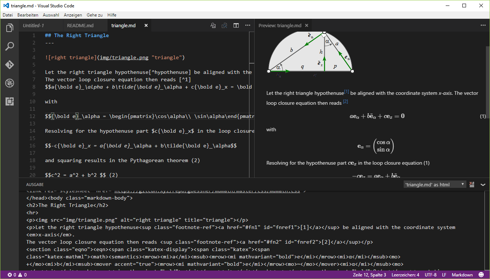

#  Markdown+Math

[](https://github.com/goessner/mdmath/license.txt)
[](https://www.npmjs.com/package/mdmath)
[](https://www.npmjs.com/package/mdmath)

## What is it ...

**mdmath** allows to use *Visual Studio Code* as a markdown editor capable of typesetting and rendering TeX math.
In fact it functions and renders identically to the built in markdown viewer. Additionally KaTeX works inside as a fast math renderer.

You can install the extension directly from [Visual Studio Code Marketplace](https://marketplace.visualstudio.com/items?itemName=goessner.mdmath).

Release 1.0 published with support of ...

* Formula numbers.
* Footnotes


## Features
Simplify the process of authoring and live previewing markdown documents containing math formulas.
This extension is a comfortable tool for scientists, engineers and students with markdown as their first choice 
document format.

* Inline math by `$ ... $`
* Display math by `$$ ... $$`
* Add formula numbering by `$$ ... $$ (1)`
* Inline math with tables
* Embedded HTML
* Syntax highlighting with code sections
* Export resulting HTML code for web usage

## Test Table

Some math expressions are collected in a [test table](http://goessner.github.io/mdmath/test/).

## Installation ...

### ... from inside of VSCode

Press <kbd>F1</kbd> key inside of *Visual Studio Code* and type `extension`. Choose `Extensions: Install Extension` 
and then select the `Markdown+Math` extension from the list.

### ... from Mac & Linux Command Line
```
cd $HOME/.vscode/extensions
git clone https://github.com/goessner/mdmath.git
cd mdmath
npm install
```

### ... from Windows Command Line
```
cd  %USERPROFILE%\.vscode\extensions
git clone https://github.com/goessner/mdmath.git
cd mdmath
npm install
```

## Usage

* Launch *VS Code*, create or open a markdown file (`.md`).
* Press <kbd>Ctrl+Shift+.</kbd> to open a preview window side by side, or ...
* .. alternatively press <kbd>Ctrl+Shift+P</kbd> and run the command `Markdown+Math` to achive the same.
* Typeset in your markdown source window and see the preview window live updating.
* Press <kbd>Ctrl+Shift+P</kbd> and run the command `Markdown+Math as HTML` to open an output window for 
  viewing and possibly copying the corresponding HTML source.



>*Note*: Attempt to show HTML output with *Preview Window* as *Active Window* results in a warning `Cannot show source of that document!`. Make your markdown source window *active* first.

You can see HTML export of `triangle.md` live in [your browser](http://goessner.github.io/mdmath/triangle.html).


## Dependencies

* [markdown-it](https://github.com/markdown-it/markdown-it). The markdown renderer also used in VS Code.
* [katex](https://github.com/Khan/KaTeX). This is where credits for fast rendering TeX math in HTML go to.
* [markdown-it-footnote](https://github.com/markdown-it/markdown-it-footnote). Using footnotes in markdown.
* [highlight.js](https://github.com/isagalaev/highlight.js). The code highlighter also used in VS Code.


## FAQ

* __Which functions does KaTeX support ?__
  * See them listed at [KaTeX Reference](https://github.com/Khan/KaTeX/wiki/Function-Support-in-KaTeX).
* __The preview window does not scroll in sync with source window__
  * No, not as long as VSCode's native preview window isn't able to do that.
* __What if I need to use the currency symbol `$` also in my markup ?__
  * It should be safe to use it. If in doubt escape it.
* __What are the restrictions with inline formulas ?__
  * Whitespace after opening `$` and before closing `$` is not allowed.
  * Numeric character before opening `$` and after closing `$` is not allowed.
  * At least one character (whitespace ?) is required between two consecutive inline formulas.
  * Line break inside is not allowed.
* __What are the restrictions with display formulas ?__
  * Not allowed inline of text. Write them on a separate line.
  * Restrictions for inline formulas do not apply.
* __Can I use math markup in code blocks ?__
  * In order to prevent converting formulas in code blocks you must escape the enclosing dollars as in `\$\frac{a}{b}\$`.


## Issues, Hints

* In order to create `*.pdf` output from your Markdown you should consider using [Pandoc](http://pandoc.org/).
* Opening multiple preview windows is not possible at current. Even changing the active markdown source window 
  doesn't update the preview window properly. Close the preview window first as a workaround here.

## Contributing

See [contributing.md](contributing.md)

## ChangeLog

* December 21, 2016
  * Release 1.0.1
  * `code block` bug removed.

* December 20, 2016
  * Release 1.0.0
  * Dependency on `markdown-it-katex` removed in favour of some lightweight regular expressions.
  * Very simple (manual) equation numbering implemented.
  * KaTeX error highlighting activated.
  * Footnotes by `markdown-it-footnote` added.
  * Standalone [tests](http://goessner.github.io/mdmath/test/) for math rendering added.
  * Markdown+Math CSS file added to [CDN](https://gitcdn.xyz/repo/goessner/mdmath/master/css/mdmath.css)
  * Some minor bugs removed.

* December 2, 2016
  * Release 0.9.0
  * Installation bug resolved

* November 25, 2016
  * First Release 0.8.0


## License

*Markdown+Math* for VS Code is licensed under the [MIT License](http://opensource.org/licenses/MIT)

 © [Stefan Gössner](https://github.com/goessner)
